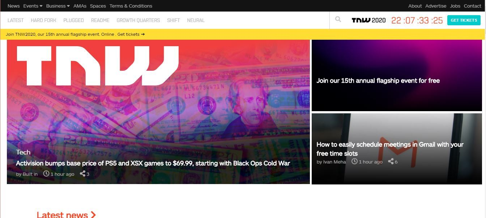
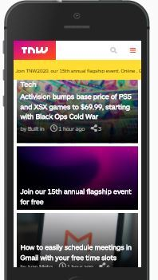
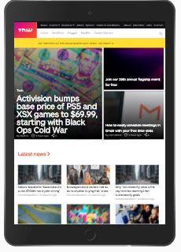

# The-Next-Web-Clone
Project 6 of 50 Microverse 

This webpage is resposive to all the iPhone(5, 6, 7, 8 and X) iPad & iPad Pro devices

# -Building with Responsive Design
Building with Responsive Design: Project 7 of 40. Microverse. 

This project consists of building a heatmap of the Smashing magazine website. The aim of this project was to examine the design pattern of the website using html,css and css positioning technologies.

## Project Requirements

### General
- You can find the original project specification at [The Odin Project]( https://www.theodinproject.com/courses/html5-and-css3/lessons/building-with-responsive-design).

### Specific to Microverse

- Align all elements with float and flex or grid.
- Use article tag for all articles listed on the page.
- Make sure to build your layout using a width of 1440px on the original page. You can use the Developer Tools to   match that screen size. For example, if you are using Google Chrome, Screen cast of how to set screen size to 1440px

## Built With

- HTML
- CSS

## Dependencies

> Refer to [Linters Config](https://github.com/eananti/linters-config/tree/master/html-css) for project setup guide.

## Live Demo
---
https://vigorous-murdock-420807.netlify.app/

## Authors
---
#### Gzim Asani
- Github:[@GZIMASANI](https://github.com/GzimAsani )
- LinkedIn:[Gzim Asani](https://www.linkedin.com/in/gzim-asani-83390a17a/ )

#### Ceejayski
- Github: [@Ceejayski](https://github.com/ceejayski)
- Twitter: [@Ceejaski1](https://twitter.com/Ceejayski1)
- Linkedin: [Okoli Chijioke](https://www.linkedin.com/in/okolichijioke/)

## Contributing
---
Contributions, issues and feature requests are welcome!

Feel free to check the [Issue]() and help us improve!

# Acknowledgments

- Hat tip to anyone whose code was used
- Inspiration
- etc

## 📝 License

All rights are reserved for the authors.
